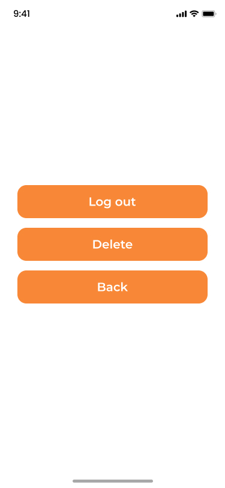

<h1 align="center">📝 TodoNote</h1>

  <strong>TodoNote</strong> is a simple and user-friendly application for managing your notes. Built with <strong>Kotlin</strong> using <strong>Jetpack Compose</strong> and integrated with <strong>Firebase</strong>, the app ensures secure management of notes and user data. It allows users to quickly create, edit, and delete notes, as well as manage their account. TodoNote is ideal for those looking for a simple yet efficient tool to organize their daily tasks or personal projects.

---

<h2>🚀 Main Features</h2>

<ul>
  <li><strong>Registration and Login</strong> via Firebase Authentication</li>
  <li><strong>Adding, editing, and deleting notes</strong></li>
  <li><strong>Account deletion</strong></li>
  <li><strong>Logging out of the account</strong></li>
  <li><strong>Managing account settings</strong> through the settings screen</li>
</ul>

---

<h2>🛠️ Technologies</h2>

<ul>
  <li><strong>Kotlin</strong>: Programming language</li>
  <li><strong>Jetpack Compose</strong>: Framework for building modern UI</li>
  <li><strong>Firebase Authentication</strong>: Handles user registration, login, and account management</li>
  <li><strong>Firebase Firestore</strong>: Stores notes securely in the cloud</li>
</ul>

---

<h2>📸 Screenshots</h2>

<table>
  <tr>
    <td align="center"><strong>Splash Screen</strong></td>
    <td align="center"><strong>Sign Up</strong></td>
    <td align="center"><strong>Sign In</strong></td>
  </tr>
  <tr>
    <td></td>
    <td></td>
    <td></td>
  </tr>
  <tr>
    <td align="center"><strong>Main Page</strong></td>
    <td align="center"><strong>Settings</strong></td>
    <td align="center"><strong>Add Note</strong></td>
  </tr>
  <tr>
    <td></td>
    <td></td>
    <td></td>
  </tr>
</table>

---

<h2>🔮 Future Plans</h2>

<ul>
  <li>Adding reminders for notes</li>
  <li>Improving the user interface</li>
  <li>Adding a search feature for notes</li>
</ul>

  We welcome your feedback and suggestions!

